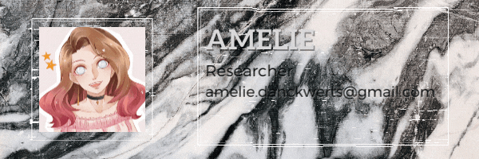

 
 
 
 
 
 

 

***

 Thank you for dropping by! I am still working out how I can format things in here so feel free to check back later!

***
   

**About Me!**
- 🌱 I'm currently a full-time intern working on a MaskRCNN image recognition software
- 👨🏽‍💻 My interest lies in Full-Stack-Engineering, DevOps, Machine Learning, Deep Learning, Security and Cybersecurity
- 💬 contact me at [amelie.danckwerts@proton.me](mailto:amelie.danckwerts@proton.me), I love to connect!

***

***

<!--Loraria/Loraria is a ✨ special ✨ repository because its `README.md` (this file) appears on your GitHub profile.
You can click the Preview link to take a look at your changes.
https://forthebadge.com/generator/  to make badges in future-->
<!-- add: social media Links; Programming languages; current goals-->
